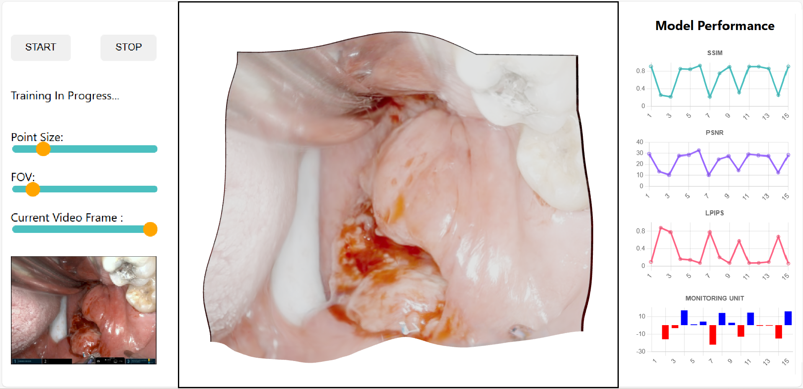

# DynamicSurg3D : Real-Time 3D Scene Reconstruction for Minimally Invasive Surgeries

## Project Overview


[](https://youtu.be/AzdwC3SvuII)

**Description:**  
This project focuses on developing a real-time 3D scene reconstruction system tailored for minimally invasive surgeries. The goal is to provide enhanced visualization that assists surgeons during complex procedures, overcoming the limitations of current methods, which lack interactivity and real-time capabilities.

Traditional 3D reconstruction methods are typically computationally intensive and require offline post-surgical analysis. These methods also struggle with dynamic camera movements and surgical manipulations common in endoscopic surgeries. To address these limitations, we developed a prototype framework that enables near-real-time reconstruction with surgeon interaction during the procedure.

---

## System Components

1. **Interactive Front-End Interface:**  
   This interface allows surgeons to interact with the 3D reconstruction during surgery, providing real-time feedback and enabling them to monitor the ongoing process.

2. **Incremental Back-End Model Training:**  
   A machine learning model processes incoming data incrementally, continuously refining the 3D reconstruction as new frames or data points become available. This reduces the need for extensive pre-surgery training while maintaining model accuracy.

3. **Periodic Monitoring Unit:**  
   A dedicated monitoring unit periodically synchronizes the front-end and back-end, ensuring the surgeon's interactions and feedback are incorporated into the reconstruction process without delay.

---

## Challenges Solved

- Real-time interaction with 3D scene reconstruction during surgery.
- Handling dynamic endoscopic views caused by camera movements and surgical manipulations.
- Managing the computational demands of real-time processing with incremental model updates.

---

## Future Work

- Extend the prototype into a production-ready system optimized for use in actual surgical environments.
- Improve the system’s robustness and real-time performance, particularly for large-scale surgeries.
- Explore further integration with robotic surgery systems to enhance interactive capabilities.

---

## 🚀 Installation and Setup Guide

This guide will help you set up the **DynamicSurg3D : Real-Time 3D Scene Reconstruction for Minimally Invasive Surgeries** project on your local machine, covering both the back-end (Python) and front-end (React) components.

### Prerequisites

Ensure the following software is installed on your system:

- **Python 3.8+**
- **Node.js 16+**
- **Conda** (if you are using Anaconda for environment management)
- **Git** (to clone the repository)
- **CUDA 11.8+** (for GPU support, if needed)

---

### Clone the Repository

```bash
git clone https://github.com/Divyanshumalik1/DynamicSurg3D.git
cd DynamicSurg3D
```

---

🖥️ Backend Setup (Python & Node.js)

#### Step 1: Set Up a Conda Environment
Create and activate a new Conda environment:

```bash
conda env create -f environment.yml
conda activate your_environment_name
```

This will install all the necessary Python packages and dependencies for the project.

#### Step 2: Install Additional Python Dependencies
Install any additional dependencies:

```bash
pip install -r requirements.txt
pip install -e submodules/diff-gaussian-rasterization-depth
pip install -e submodules/simple-knn
```

#### Step 3: Verify CUDA for GPU (Optional)
To ensure PyTorch is utilizing CUDA for GPU acceleration, verify that your setup detects your GPU:

```python
import torch
print(torch.cuda.is_available())  # Should return True if CUDA is enabled
```

#### Step 4: Navigate to the Backend Directory
First, move into the backend directory:

```bash
cd Backend
```

#### Step 5: Clone the Depth-Anything Repository
Clone the Depth-Anything repository into the backend directory:

```bash
git clone https://github.com/LiheYoung/Depth-Anything
cd Depth-Anything
pip install -r requirements.txt
```

This will install all the required Python dependencies for Depth-Anything and its submodules.

#### Step 6: Prepare the Pretrained Depth Models
Download the pretrained `depth_anything_vits14.onnx` model and place it in the specified folder:

- Download the ONNX model from here ( https://github.com/fabio-sim/Depth-Anything-ONNX/releases ).
- Place the downloaded model in the following directory:

```bash
./submodules/depth_anything/weights/depth_anything_vits14.onnx
```

#### Step 7: Install Node.js in the Backend Directory
Your backend also requires Node.js. Install the necessary Node.js packages by navigating to the backend folder:

```bash
npm install
```

#### Step 8: Verify the Conda Environment
Ensure the Conda environment is still active and install any additional Python dependencies:

```bash
conda activate your_environment_name
```

---

## Frontend Setup (React)

The front-end is built using React. You need to install the required Node.js packages.

#### Step 1: Navigate to the Frontend Directory

Move into the `Frontend` folder (or whichever directory contains the React app):

```bash
cd Frontend
```

#### Step 2: Install Node.js Dependencies

Install the required dependencies from `package.json`:

```bash
npm install
```

#### Step 3: Run the Development Server

To start the React development server:

```bash
npm start
```

This will start the development server, and you can access the app by navigating to [http://localhost:3000](http://localhost:3000) in your browser.

---

🚀 Running the Application

#### Step 1: Run the Node.js Server
Navigate to the backend directory and run the Node.js server:

```bash
node server.js
```

This will start the Node.js server, which handles auxiliary tasks like WebSocket communications or serving static files for the frontend.

The `server.js` file sets up an Express server that:

- Serves JSON data from a specified directory.
- Watches for file changes using `chokidar`.
- Exposes a `/data` endpoint to fetch the data in real time, which is especially useful when the backend is processing or updating files.

#### Step 2: Run the Flask Applications
Your backend involves running multiple Flask services on different ports. Run each one in a separate terminal.

##### Start the PC View Server:

```bash
FLASK_APP=view_pc_server.py flask run --host 0.0.0.0 --port 5000
```

This starts the Flask server for the 3D scene reconstruction viewer. The server handles the following:

- Socket.IO communications for real-time data exchange between the backend and the frontend.
- Point cloud data and PNG frames are served to visualize the reconstructed 3D scene in real-time.

The PC view server is the core component that streams the 3D scene data to the frontend, enabling interactive visualization for the surgeons.

##### Start the Video Processing Server:

```bash
FLASK_APP=video_processing.py flask run --host 0.0.0.0 --port 5001
```

This starts the Flask server that handles video processing tasks. It involves several key operations:

- **Running Depth-Anything Model:** The server processes videos frame by frame, extracting 3D depth information from each frame using the pretrained Depth-Anything model.
- **YOLOv8 Inference:** It runs YOLOv8 inference on video frames to generate grayscale masks.
- **Incremental Training:** The server supports batch training and incremental learning, processing new data in real time.
- **Multithreading:** It uses Flask routes and multithreading to handle multiple tasks simultaneously, such as video frame extraction, YOLO inference, and model training, ensuring efficient data processing.

Both the PC View Server and Video Processing Server communicate with the frontend and provide the necessary data for real-time 3D visualization and video processing.

The front-end should open in your default browser at `http://localhost:3000`, and the back-end will process your input video for 3D reconstruction.

---

## Key Technologies

- **Machine Learning:** Incremental model training for 3D scene reconstruction.
- **Computer Vision:** Real-time video processing and multimodal image integration.
- **Front-End:** Interactive user interface for surgeons (React/Flask/Other Frameworks).
- **Back-End:** Python-based machine learning pipeline (PyTorch, OpenCV, etc.).

---

## Keywords

- Endoscopic surgery
- 3D scene reconstruction
- Real-time processing
- Incremental learning
- Multimodal image data
- Interactive visualization

